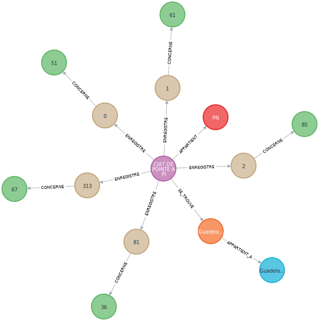
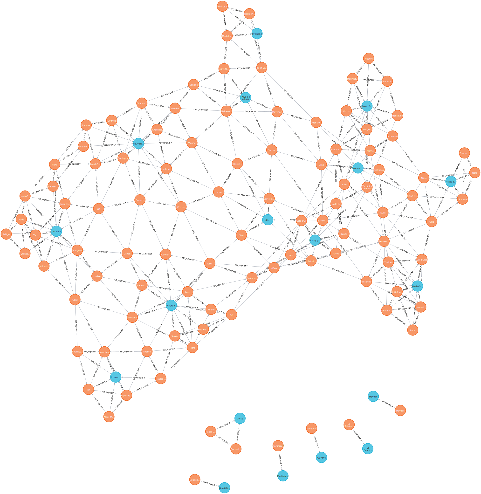
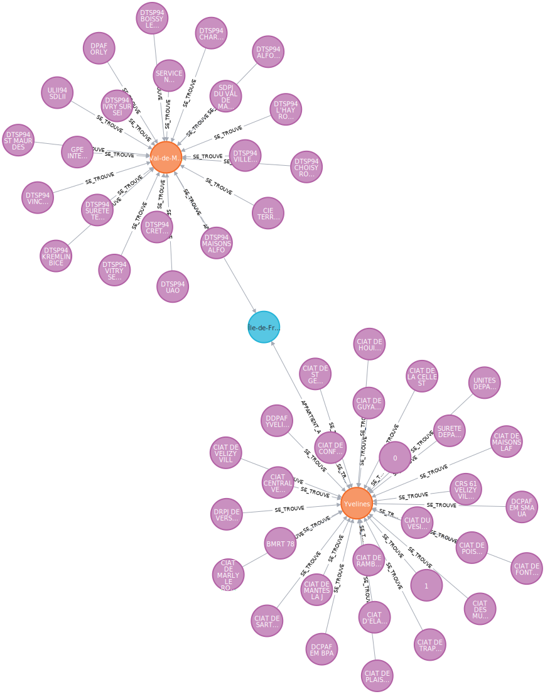
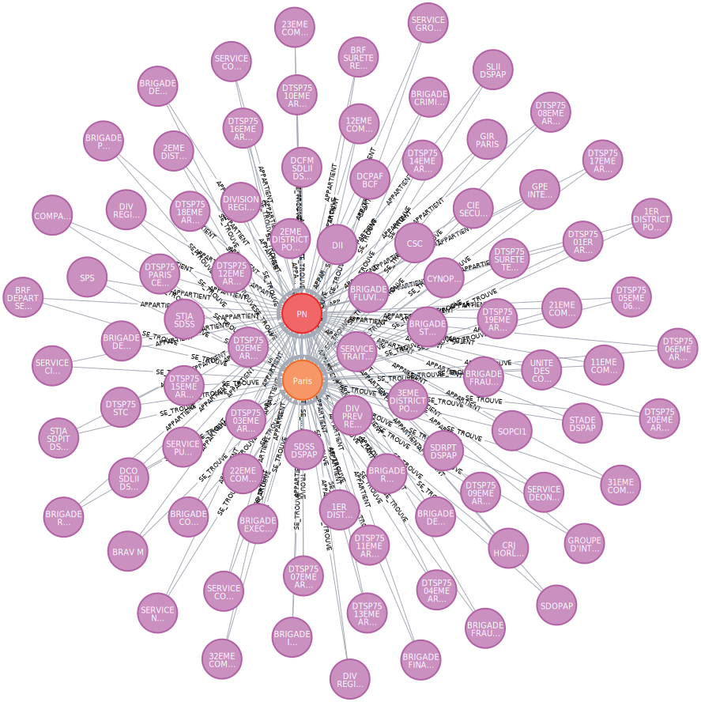
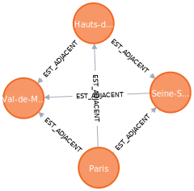
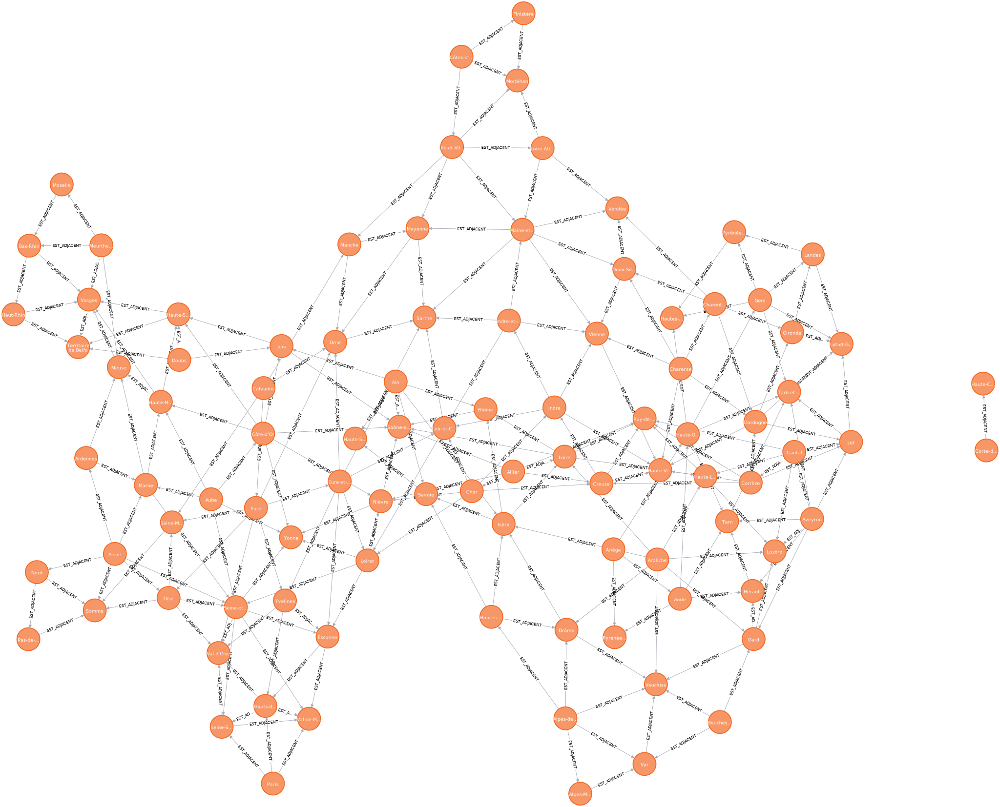
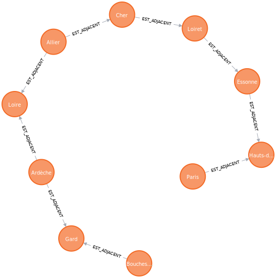
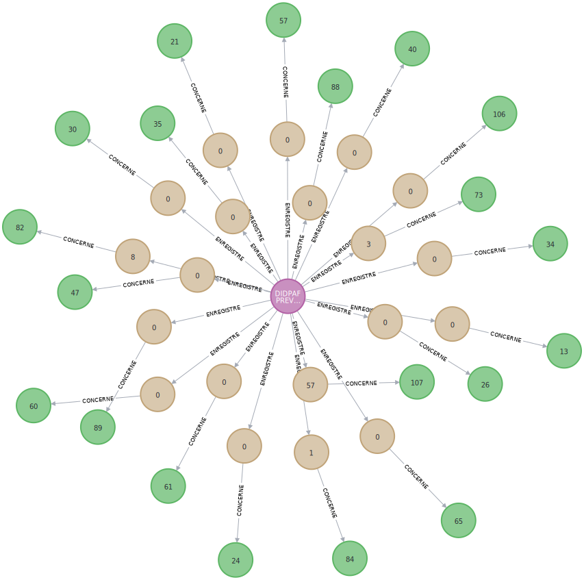

# Migration d'une base relationnelle vers un modèle graphe — Crimes et délits (2012-2022)

---

**Groupe 4 VCOD TP 1** : CHABANEL Tristan, COTTE Loïc, DESVALCY Andrew, MINUSKER Okan

**Formation** : BUT Science des Données — SAE NoSQL

**Date** : Mars 2026

**Dépôt GitHub** : https://github.com/loiccotte/SAE-Migration-Donnees-NoSQL

**Vidéo de présentation** : https://www.youtube.com/watch?v=xdYHTb8rBQ0

---

## Sommaire

1. Introduction
2. Phase 1 — Analyse des données et modélisation relationnelle
3. Phase 2 — Limites du relationnel et passage au graphe
4. Phase 3 — Migration des données
5. Phase 4 — Validation et exploitation
6. Ajout de nouvelles données
7. Difficultés rencontrées
8. Conclusion

---

## 1. Introduction

### 1.1 Contexte

Chaque année, le Ministère de l'Intérieur collecte les statistiques de criminalité sur tout le territoire français. Les données couvrent la période 2012-2022 et proviennent de deux sources : la Police Nationale (PN) en zone urbaine, et la Gendarmerie Nationale (GN) en zone rurale et périurbaine. Au total, on parle de plus d'un million d'enregistrements répartis sur 101 départements et 107 types d'infractions.

À l'origine, tout est stocké dans un gros fichier Excel avec un format matriciel. Ça se lit bien à l'œil, mais c'est pénible à exploiter par programme.

### 1.2 Problématique

Le Ministère veut pouvoir répondre à des questions du type : quels départements voisins ont des pics de criminalité similaires ? Quels services couvrent quel territoire ? Ce genre de questions tourne autour des relations entre les entités. En SQL classique, ça implique beaucoup de jointures imbriquées et des requêtes récursives dès qu'on veut suivre un chemin dans les données. D'où l'idée de tester un modèle graphe.

### 1.3 Objectifs

1. Structurer les données Excel en base relationnelle PostgreSQL.
2. Montrer où le relationnel coince face à certaines requêtes.
3. Concevoir un modèle graphe Neo4j adapté.
4. Migrer toutes les données vers Neo4j.
5. Vérifier que rien n'a été perdu et montrer ce que le graphe apporte.

---

## 2. Phase 1 — Analyse des données et modélisation relationnelle

### 2.1 Le fichier Excel source

Le fichier contient 20 onglets : un par croisement service (PN/GN) x année (2012 à 2022).

Chaque onglet est au format matriciel :

| | Dept 01 - Zone A | Dept 01 - Zone B | Dept 02 - Zone A | ... |
|---|---|---|---|---|
| Infraction 1 | 42 | 18 | 7 | ... |
| Infraction 2 | 105 | 33 | 22 | ... |

Les lignes correspondent aux 107 types d'infractions, les colonnes aux zones géographiques (commissariats, brigades), et les cellules au nombre de faits constatés.

On a rencontré plusieurs problèmes avec ce fichier :

1. Il y a 3 lignes d'en-tête par onglet (département, nom de zone, code service) au lieu d'une seule. Pandas ne gère pas ça tout seul.
2. Les codes département sont alphanumériques : la Corse utilise `2A` et `2B`, donc on ne peut pas stocker ça en entier.
3. Il faut gérer les doublons potentiels entre onglets.

### 2.2 Processus ETL

Le script `etl.py` transforme le fichier Excel en CSV exploitable :

```
Fichier Excel (20 onglets, format pivot)
        |
        v
Script ETL Python (Pandas)
   1. Lecture des 3 lignes d'en-tête
   2. Unpivot (melt) du format matriciel
   3. Nettoyage et enrichissement
        |
        v
CSV vertical (1 ligne = 1 observation)
```

L'opération qui fait tout le travail, c'est le `melt` (unpivot). On passe d'un format large à un format long :

Avant (format matriciel) :

| code_index | libellé | Zone_A | Zone_B |
|---|---|---|---|
| 01 | Vol simple | 42 | 18 |

Après (format vertical) :

| code_index | libellé | zone | faits |
|---|---|---|---|
| 01 | Vol simple | Zone_A | 42 |
| 01 | Vol simple | Zone_B | 18 |

Chaque cellule du tableau original devient une ligne. On passe de "1 ligne = 1 infraction pour N zones" à "1 ligne = 1 observation". Pandas est pratique ici : il lit les fichiers Excel multi-onglets nativement et la méthode `melt()` fait exactement cette opération d'unpivot.

### 2.3 Modèle Conceptuel (MCD)

On a opté pour un schéma en étoile centré sur la table de faits `enregistrement`.

| Entité | Rôle |
|---|---|
| Région | Découpage administratif de niveau 1 (18 régions) |
| Département | Découpage de niveau 2 (101 départements) |
| Service | Unité opérationnelle, commissariat ou brigade (1 239) |
| Périmètre | Type de service : PN ou GN (2) |
| Infraction | Type de crime/délit selon la nomenclature officielle (107) |
| Enregistrement | Fait statistique : nombre de faits constatés (1 120 775) |

Cardinalités principales :

- 1 Région contient 1 à N Départements
- 1 Département contient 1 à N Services
- 1 Service appartient à 1 seul Département
- Service et Périmètre sont liés en N-N (via table d'association)
- 1 Enregistrement correspond à 1 Service + 1 Infraction

Le schéma MCD complet est dans `MCD/MCD_VF.png`.

### 2.4 Modèle logique et physique

Le schéma SQL comprend 7 tables : `region`, `departement`, `service`, `perimetre`, `service_perimetre` (table d'association N-N), `infraction` et `enregistrement`. Le DDL complet est disponible dans le fichier `sql_ddl_postgres.sql` du projet.

Choix techniques principaux :

- `VARCHAR` partout pour les codes, à cause des codes corses `2A`/`2B` qu'on ne peut pas stocker en entier.
- `CHECK (nb_faits >= 0)` pour empêcher les valeurs négatives.
- `UNIQUE (annee, code_service, code_index)` pour garantir un seul enregistrement par triplet.
- Clés étrangères entre toutes les tables pour garantir l'intégrité référentielle.

### 2.5 Alimentation de la base

Le script `load_csvs_to_postgres_pg8000.py` charge 7 fichiers CSV dans PostgreSQL, dans l'ordre imposé par les clés étrangères :

1. `region` puis 2. `departement` puis 3. `service` puis 4. `perimetre` puis 5. `service_perimetre` puis 6. `infraction` puis 7. `enregistrement`

Deux techniques qu'on a utilisées :

- Batching par lots de 5 000 : au lieu d'insérer 1,1 million de lignes une par une (très lent à cause des allers-retours réseau), on les regroupe par paquets de 5 000.

- `ON CONFLICT DO NOTHING` : si on relance le script, les lignes déjà présentes sont ignorées au lieu de provoquer des erreurs. Ça rend le chargement idempotent, on peut le relancer autant de fois qu'on veut sans risque.

| Table | Fichier CSV | Lignes |
|---|---|---|
| region | region.csv | 18 |
| departement | departement.csv | 101 |
| service | service.csv | 1 239 |
| perimetre | perimetre.csv | 2 |
| service_perimetre | appartient.csv | 1 239 |
| infraction | infraction.csv | 107 |
| enregistrement | enregistrement.csv | 1 120 775 |

---

## 3. Phase 2 — Limites du relationnel et passage au graphe

### 3.1 Où le SQL coince

#### Les jointures s'empilent vite

Pour répondre à "Quels sont les crimes les plus fréquents en Île-de-France ?", il faut traverser Région, Département, Service, Enregistrement et Infraction. Ça fait 4 jointures :

```sql
SELECT i.libelle, SUM(e.nb_faits) AS total
FROM region r
JOIN departement d ON d.id_region = r.id_region
JOIN service s ON s.code_dept = d.code_dept
JOIN enregistrement e ON e.code_service = s.code_service
JOIN infraction i ON i.code_index = e.code_index
WHERE r.nom_region = 'Île-de-France'
GROUP BY i.libelle
ORDER BY total DESC LIMIT 10;
```

En Cypher (Neo4j), la même question se lit beaucoup plus naturellement :

```cypher
MATCH (s:Service)-[:SE_TROUVE]->(d:Departement)-[:APPARTIENT_A]->(r:Region),
      (s)-[:ENREGISTRE]->(e:Enregistrement)-[:CONCERNE]->(i:Infraction)
WHERE r.nom_region = 'Île-de-France'
RETURN i.libelle AS infraction, SUM(e.nb_faits) AS total
ORDER BY total DESC LIMIT 10
```

On "dessine" le chemin qu'on veut parcourir au lieu de spécifier les conditions de jointure une par une.

#### Les requêtes récursives pour les chemins

La question "Quel est le plus court chemin entre Paris et Marseille via les adjacences ?" nécessite en SQL une CTE récursive d'une vingtaine de lignes. En Cypher, ça tient en 3 lignes :

```cypher
MATCH path = shortestPath(
  (a:Departement {code_dept: '75'})-[:EST_ADJACENT*]-(b:Departement {code_dept: '13'})
)
RETURN path
```

#### Résumé

| Opération | SQL | Cypher |
|---|---|---|
| Traversée hiérarchique | N jointures | Pattern chaîné |
| Plus court chemin | CTE récursive (~20 lignes) | `shortestPath` (3 lignes) |
| Voisins des voisins | Self-JOIN multiples | `*2` dans le pattern |

### 3.2 Pourquoi le graphe colle mieux à ces données

Les données de criminalité forment un réseau : des services dans des départements, des départements dans des régions, des départements voisins les uns des autres. Les questions métier sont des questions de relations, quels voisins ? quels chemins ? quelle couverture ?

Dans Neo4j, les relations sont des objets à part entière (avec un type, des propriétés, une direction), pas juste un mécanisme technique comme une clé étrangère. Le modèle de données et les questions métier parlent le même langage.

Neo4j utilise aussi ce qu'on appelle l'index-free adjacency : chaque nœud stocke un pointeur direct vers ses voisins. Traverser une relation est en temps constant, quelle que soit la taille du graphe. En SQL, chaque jointure passe par un index dont le coût dépend du volume de données.

### 3.3 Conception du modèle graphe

#### Règles de transformation

On a appliqué 5 règles pour passer du relationnel au graphe :

| Règle | Relationnel | Graphe |
|---|---|---|
| 1 | Table d'entité | Nœud avec propriétés |
| 2 | Clé étrangère | Relation (la colonne FK disparaît du nœud) |
| 3 | Table d'association pure (N-N) | Relation directe (la table disparaît) |
| 4 | Table d'association avec attributs | Nœud intermédiaire + 2 relations |
| 5 | Auto-référence | Relation entre nœuds du même label |

#### Exemples concrets

Règle 2 -- La FK devient une relation :

PostgreSQL `departement` :

| code_dept | nom_dept | id_region |
|---|---|---|
| 75 | Paris | REG-11 |

Neo4j :
```
(:Departement {code_dept: "75", nom_dept: "Paris"})
  -[:APPARTIENT_A]->
(:Region {id_region: "REG-11"})
```

La colonne `id_region` disparaît du nœud Département. Elle est remplacée par la relation `APPARTIENT_A`.

Règle 3 -- La table d'association disparaît :

PostgreSQL `service_perimetre` :

| code_service | id_perimetre |
|---|---|
| SVC-00001 | PN |

Neo4j :
```
(:Service {code_service: "SVC-00001"}) -[:APPARTIENT]-> (:Perimetre {id_perimetre: "PN"})
```

La table `service_perimetre` n'existe plus. Chaque ligne devient une relation directe.

#### Transformation table par table

| Table PostgreSQL | Ce qu'elle devient dans Neo4j |
|---|---|
| `region` | Nœud `:Region` |
| `departement` | Nœud `:Departement` + relation `APPARTIENT_A` vers Région. Colonne `id_region` supprimée. |
| `service` | Nœud `:Service` + relation `SE_TROUVE` vers Département. Colonne `code_dept` supprimée. |
| `perimetre` | Nœud `:Perimetre` |
| `service_perimetre` | Table supprimée. Devient relation `APPARTIENT` (Service vers Périmètre). |
| `infraction` | Nœud `:Infraction` |
| `enregistrement` | Nœud `:Enregistrement` + relations `ENREGISTRE` et `CONCERNE`. Colonnes FK supprimées. |
| `adjacence` | Relation `EST_ADJACENT` entre deux `:Departement` |

#### Schéma du graphe final

```
(Service)-[:SE_TROUVE]->(Departement)-[:APPARTIENT_A]->(Region)
(Service)-[:APPARTIENT]->(Perimetre)
(Service)-[:ENREGISTRE]->(Enregistrement)-[:CONCERNE]->(Infraction)
(Departement)-[:EST_ADJACENT]->(Departement)
```

6 labels de nœuds, 6 types de relations.

---

## 4. Phase 3 — Migration des données

### 4.1 Choix de la méthode de migration

Plusieurs méthodes existent pour migrer des données vers Neo4j :

- **ETL applicatif (Python + driver Bolt)** : un script Python lit PostgreSQL et écrit dans Neo4j via le driver officiel.
- **LOAD CSV** : commande Cypher native qui lit directement des fichiers CSV.
- **neo4j-admin import** : outil en ligne de commande pour l'import massif (base vide uniquement).
- **APOC (JDBC)** : bibliothèque de procédures étendues avec connexion directe vers un SGBDR.

On a choisi l'ETL applicatif en Python car on avait besoin de transformer les données pendant la migration (FK vers relations, suppression de la table d'association, conversion de types) et de gérer les erreurs lot par lot sur 1,1 million de lignes.

### 4.2 Le script de migration en détail

Le script `migrate_pg_to_neo4j_pg8000.py` fonctionne en étapes séquentielles.

#### Contraintes d'unicité

```python
s.run("CREATE CONSTRAINT region_pk IF NOT EXISTS FOR (r:Region) REQUIRE r.id_region IS UNIQUE")
s.run("CREATE CONSTRAINT dept_pk IF NOT EXISTS FOR (d:Departement) REQUIRE d.code_dept IS UNIQUE")
# ... idem pour chaque label
```

Ces contraintes sont l'équivalent des clés primaires côté graphe. Elles garantissent l'unicité et créent un index pour accélérer les `MERGE`.

#### Migration entité par entité

Pour chaque entité, le script fait : lecture SQL puis écriture Cypher.

Exemple avec les départements :

```python
# Lecture depuis PostgreSQL
fetch("SELECT code_dept, nom_dept, id_region FROM departement")

# Écriture dans Neo4j
"UNWIND $rows AS row "
"MERGE (d:Departement {code_dept: row.code_dept}) SET d.nom_dept = row.nom_dept "
"WITH row, d MATCH (r:Region {id_region: row.id_region}) MERGE (d)-[:APPARTIENT_A]->(r)"
```

On lit `id_region` depuis PostgreSQL, mais on ne la stocke pas comme propriété du nœud. Elle sert uniquement à créer la relation `APPARTIENT_A`. C'est la règle 2 en action.

Exemple avec la table d'association :

```python
fetch("SELECT code_service, id_perimetre FROM service_perimetre")

"UNWIND $rows AS row "
"MATCH (s:Service {code_service: row.code_service}) "
"MATCH (p:Perimetre {id_perimetre: row.id_perimetre}) "
"MERGE (s)-[:APPARTIENT]->(p)"
```

Pas de nœud créé ici : chaque ligne devient directement une relation.

#### UNWIND + MERGE

UNWIND prend une liste de lignes et les traite une par une dans une seule requête Cypher. Au lieu de 2 000 requêtes individuelles (2 000 allers-retours réseau), on envoie 1 seule requête contenant 2 000 lignes.

MERGE veut dire "crée si ça n'existe pas, sinon ne fais rien". Ça rend la migration idempotente, on peut la relancer sans créer de doublons.

Les enregistrements (1,1 million de lignes) sont traités par lots de 1 200 (plus petit que les autres entités car chaque ligne crée 1 nœud + 2 relations).

### 4.3 Enrichissement des données

En plus de la migration, on a ajouté 239 relations d'adjacence entre départements (quels départements partagent une frontière). Ces données viennent de sources publiques.

```python
"UNWIND $rows AS row "
"MATCH (da:Departement {code_dept: row.dept_a}) "
"MATCH (db:Departement {code_dept: row.dept_b}) "
"MERGE (da)-[:EST_ADJACENT]->(db)"
```

Ça montre un avantage concret du graphe : ajouter un nouveau type de relation ne modifie pas le schéma existant. On crée de nouvelles connexions entre des nœuds déjà présents, c'est tout.

---

## 5. Phase 4 — Validation et exploitation

### 5.1 Vérification de cohérence

On a fait des comptages exhaustifs pour vérifier que chaque nœud et chaque relation dans Neo4j correspond à une ligne dans PostgreSQL.

| Entité / Relation | PostgreSQL | Neo4j | Écart |
|---|---|---|---|
| Régions | 18 | 18 | 0 |
| Départements | 101 | 101 | 0 |
| Services | 1 239 | 1 239 | 0 |
| Périmètres | 2 | 2 | 0 |
| Infractions | 107 | 107 | 0 |
| Enregistrements | 1 120 775 | 1 120 775 | 0 |
| APPARTIENT_A | 101 | 101 | 0 |
| SE_TROUVE | 1 239 | 1 239 | 0 |
| APPARTIENT | 1 239 | 1 239 | 0 |
| ENREGISTRE | 1 120 775 | 1 120 775 | 0 |
| CONCERNE | 1 120 775 | 1 120 775 | 0 |
| EST_ADJACENT | 239 | 239 | 0 |

Aucune donnée perdue ni dupliquée, 100% de cohérence.

### 5.2 Requêtes métier

#### Requête 1 -- Comptage des nœuds et relations

**Utilité** : Vérifier qu'aucune donnée n'a été perdue après migration. Le Ministère doit certifier que les statistiques publiées sont complètes ; cette requête sert de test de non-régression.

```cypher
MATCH (n)
RETURN labels(n)[0] AS label, COUNT(n) AS nombre
ORDER BY nombre DESC
```

```cypher
MATCH ()-[r]->()
RETURN type(r) AS relation, COUNT(r) AS nombre
ORDER BY nombre DESC
```


#### Requête 2 -- Visualisation du modèle complet

**Utilité** : Valider visuellement que le schéma graphe est conforme à la conception. Permet aux analystes de vérifier que le modèle correspond au domaine métier (services, départements, infractions) et de repérer une relation manquante ou mal orientée.

```cypher
MATCH (s:Service)-[:SE_TROUVE]->(d:Departement)-[:APPARTIENT_A]->(r:Region),
      (s)-[:APPARTIENT]->(p:Perimetre),
      (s)-[:ENREGISTRE]->(e:Enregistrement)-[:CONCERNE]->(i:Infraction)
RETURN s, d, r, p, e, i
LIMIT 5
```



#### Requête 3 -- Top 10 des infractions les plus fréquentes

**Utilité** : Produire le classement national des infractions pour le bilan annuel de la délinquance. Oriente les politiques de prévention : si les vols sans violence dominent, cela justifie des campagnes ciblées plutôt que des renforts d'effectifs.

```cypher
MATCH (e:Enregistrement)-[:CONCERNE]->(i:Infraction)
RETURN i.libelle AS infraction, SUM(e.nb_faits) AS total_faits
ORDER BY total_faits DESC
LIMIT 10
```


#### Requête 4 -- Top 3 des crimes par département

**Utilité** : Les préfets utilisent ce classement pour rédiger les plans départementaux de prévention de la délinquance (PDPD). Les infractions dominantes diffèrent fortement entre un département urbain et rural, ce qui conduit à des stratégies différentes.

```cypher
MATCH (s:Service)-[:SE_TROUVE]->(d:Departement),
      (s)-[:ENREGISTRE]->(e:Enregistrement)-[:CONCERNE]->(i:Infraction)
WITH d.nom_dept AS departement, i.libelle AS infraction, SUM(e.nb_faits) AS total
ORDER BY departement, total DESC
WITH departement, COLLECT({infraction: infraction, total: total})[0..3] AS top3
UNWIND top3 AS t
RETURN departement, t.infraction AS infraction, t.total AS total_faits
```


#### Requête 5 -- Hiérarchie régions / départements

**Utilité** : Valider le rattachement de chaque département à sa région, notamment après la réforme territoriale de 2016. Sert de support pour les réunions inter-régionales de sécurité.

```cypher
MATCH (d:Departement)-[:APPARTIENT_A]->(r:Region)
RETURN d, r
```



#### Requête 6 -- Services d'une région (Île-de-France)

**Utilité** : L'Île-de-France concentre 20% de la population et une part importante de la criminalité. Cette vue permet d'évaluer la couverture territoriale et de planifier les renforts inter-départementaux lors d'événements majeurs.

```cypher
MATCH (s:Service)-[:SE_TROUVE]->(d:Departement)-[:APPARTIENT_A]->(r:Region)
WHERE r.nom_region = 'Île-de-France'
RETURN s, d, r
LIMIT 50
```



#### Requête 7 -- Répartition Police / Gendarmerie

**Utilité** : La France a un système dual PN/GN. Visualiser la répartition par département est essentiel pour éviter les doublons de compétence et analyser correctement les statistiques (les méthodes de comptage diffèrent entre les deux forces).

```cypher
MATCH (s:Service)-[:SE_TROUVE]->(d:Departement),
      (s)-[:APPARTIENT]->(p:Perimetre)
WHERE d.nom_dept = 'Paris'
RETURN s, d, p
```



#### Requête 8 -- Adjacences d'un département

**Utilité** : Lors d'un pic de criminalité, les départements voisins sont alertés (plans de recherche inter-départementaux). Cette requête fournit instantanément la liste des départements à alerter et illustre l'avantage du graphe sur le SQL pour les questions spatiales.

```cypher
MATCH (d:Departement {code_dept: '75'})-[:EST_ADJACENT]-(voisin:Departement)
RETURN d, voisin
```



#### Requête 9 -- Carte complète des adjacences

**Utilité** : Représentation topologique du territoire. Permet à l'OCLDI (délinquance itinérante) de modéliser les corridors de déplacement et d'identifier les départements "carrefours" ayant le plus de routes de transit.

```cypher
MATCH (a:Departement)-[:EST_ADJACENT]->(b:Departement)
RETURN a, b
```



#### Requête 10 -- Plus court chemin entre deux départements

**Utilité** : Planifier des escortes de détenus ou anticiper les itinéraires de fuite en traversant le minimum de départements. En SQL, cette requête nécessite une CTE récursive de 20 lignes ; en Cypher, `shortestPath` le fait en 3 lignes.

```cypher
MATCH (a:Departement {code_dept: '75'}),
      (b:Departement {code_dept: '13'}),
      path = shortestPath((a)-[:EST_ADJACENT*]-(b))
RETURN path
```



#### Requête 11 -- Détail des enregistrements d'un service

**Utilité** : Auditer un commissariat ou une brigade spécifique lors d'inspections (IGPN/IGGN). Permet de détecter des anomalies statistiques en visualisant l'ensemble de l'activité d'un service.

```cypher
MATCH (s:Service)-[:ENREGISTRE]->(e:Enregistrement)-[:CONCERNE]->(i:Infraction)
WHERE s.code_service = '1'
RETURN s, e, i
LIMIT 20
```



### 5.3 Comparaison SQL vs Cypher

#### Exemple 1 -- Crimes par région

SQL (4 jointures) :
```sql
SELECT i.libelle, SUM(e.nb_faits) AS total
FROM region r
JOIN departement d ON d.id_region = r.id_region
JOIN service s ON s.code_dept = d.code_dept
JOIN enregistrement e ON e.code_service = s.code_service
JOIN infraction i ON i.code_index = e.code_index
WHERE r.nom_region = 'Île-de-France'
GROUP BY i.libelle ORDER BY total DESC LIMIT 10;
```

Cypher (pattern direct) :
```cypher
MATCH (s:Service)-[:SE_TROUVE]->(d:Departement)-[:APPARTIENT_A]->(r:Region),
      (s)-[:ENREGISTRE]->(e:Enregistrement)-[:CONCERNE]->(i:Infraction)
WHERE r.nom_region = 'Île-de-France'
RETURN i.libelle, SUM(e.nb_faits) AS total
ORDER BY total DESC LIMIT 10
```

#### Exemple 2 -- Plus court chemin

SQL (~20 lignes de CTE récursive) :
```sql
WITH RECURSIVE chemin AS (
  SELECT dept_a, dept_b, 1 AS profondeur, ARRAY[dept_a, dept_b] AS parcours
  FROM adjacence WHERE dept_a = '75'
  UNION ALL
  SELECT c.dept_a, a.dept_b, c.profondeur + 1, c.parcours || a.dept_b
  FROM chemin c JOIN adjacence a ON a.dept_a = c.dept_b
  WHERE a.dept_b != ALL(c.parcours) AND c.profondeur < 20
)
SELECT parcours FROM chemin WHERE dept_b = '13'
ORDER BY profondeur LIMIT 1;
```

Cypher (3 lignes) :
```cypher
MATCH path = shortestPath(
  (a:Departement {code_dept: '75'})-[:EST_ADJACENT*]-(b:Departement {code_dept: '13'})
)
RETURN path
```

#### Exemple 3 -- Répartition PN/GN par département

SQL (3 jointures, table d'association explicite) :
```sql
SELECT p.nom_perimetre, COUNT(s.code_service) AS nb_services
FROM departement d
JOIN service s ON s.code_dept = d.code_dept
JOIN service_perimetre sp ON sp.code_service = s.code_service
JOIN perimetre p ON p.id_perimetre = sp.id_perimetre
WHERE d.nom_dept = 'Paris'
GROUP BY p.nom_perimetre;
```

Cypher (relation directe, pas de table intermédiaire) :
```cypher
MATCH (s:Service)-[:SE_TROUVE]->(d:Departement),
      (s)-[:APPARTIENT]->(p:Perimetre)
WHERE d.nom_dept = 'Paris'
RETURN p.nom_perimetre, COUNT(s) AS nb_services
```

#### Synthèse

| Critère | SQL | Cypher |
|---|---|---|
| Lisibilité | Technique (jointures) | Naturelle (patterns) |
| Traversées profondes | N jointures | Suivi de pointeurs |
| Plus courts chemins | CTE récursive | `shortestPath` natif |
| Tables d'association | Jointure obligatoire | Relation directe |

---

## 6. Ajout de nouvelles données

Pour ajouter une nouvelle année ou un nouveau type d'infraction, les deux bases offrent des approches différentes.

En **PostgreSQL**, l'ordre d'insertion est contraint par les clés étrangères (il faut créer l'infraction avant l'enregistrement) et l'idempotence repose sur `ON CONFLICT DO NOTHING`.

En **Neo4j**, `MERGE` permet d'insérer dans n'importe quel ordre et garantit nativement l'idempotence. Exemple d'ajout d'un enregistrement :

```cypher
MATCH (s:Service {code_service: 'SVC-00001'})
MATCH (i:Infraction {code_index: '01'})
MERGE (e:Enregistrement {id_enregistrement: '2023-SVC-00001-01'})
SET e.annee = '2023', e.nb_faits = 42
MERGE (s)-[:ENREGISTRE]->(e)
MERGE (e)-[:CONCERNE]->(i)
```

| Critère | PostgreSQL | Neo4j |
|---|---|---|
| Ordre d'insertion | Contraint par les FK | Flexible |
| Idempotence | `ON CONFLICT DO NOTHING` | `MERGE` natif |
| Modification du schéma | Nécessaire si nouveau type d'entité | Pas nécessaire |
| Validation | CHECK, FK, UNIQUE automatiques | Contraintes d'unicité + logique applicative |

Le graphe est plus souple, mais offre moins de garde-fous automatiques que le relationnel.

---

## 7. Difficultés rencontrées

| Problème | Ce qui coinçait | Comment on a fait |
|---|---|---|
| Format Excel matriciel | Format pivot inadapté au traitement | Méthode `pd.melt()` de Pandas |
| 3 lignes d'en-tête | Pandas ne gère pas ça nativement | Lecture séparée avec `nrows=3` + mapping manuel |
| Codes 2A/2B (Corse) | Impossible de stocker en entier | `VARCHAR` systématique pour tous les codes |
| 1,1 million de lignes | Insertion unitaire beaucoup trop lente | Batching (5 000 en PG, 1 200 en Neo4j) |
| Coordination Docker | La migration démarrait avant que les bases soient prêtes | Healthcheck + `depends_on: condition: service_healthy` |

---

## 8. Conclusion

On a migré l'intégralité des données de criminalité depuis PostgreSQL vers Neo4j :

- 1 120 775 enregistrements migrés sans perte
- 6 types de nœuds et 6 types de relations
- 239 relations d'adjacence ajoutées en enrichissement
- 11 requêtes métier qui montrent ce que le graphe apporte

Quelques recommandations si le projet devait être poussé plus loin :

1. Garder les deux bases : PostgreSQL pour le stockage de référence, Neo4j pour l'analyse relationnelle.
2. Enrichir le graphe avec des données supplémentaires (démographie, flux de criminalité, relations entre types d'infractions).
3. Former les analystes à Cypher : le langage se prend en main assez vite pour des questions relationnelles.
4. Industrialiser le pipeline avec du logging, des métriques, et une orchestration type Airflow pour les mises à jour planifiées.

On pourrait aussi aller plus loin avec les outils de Graph Data Science de Neo4j (détection de communautés, centralité) ou brancher des dashboards avec Neo4j Bloom ou Grafana.
